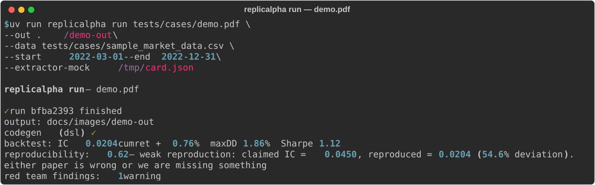

# replicalpha

[English](README.md) · [简体中文](README.zh-CN.md)

[](https://github.com/VernonOY/replicalpha/actions/workflows/ci.yml)
[](https://www.python.org)
[](LICENSE)
[](#quality)
[](https://github.com/VernonOY/replicalpha/releases)

> Research-reproduction Agent: PDF → factor code → backtest → Red Team Validator → reproducibility score.

replicalpha takes a quant research PDF and produces a complete reproduction
bundle in one command — structured paper metadata, executable Python factor
code, backtest results, automated Red Team findings, and a plain-English
reproducibility score.

## Live demo

One command, bundled synthetic PDF + CSV, no API key:



The full generated research report is in [docs/images/demo-report.md](docs/images/demo-report.md) — factor code, backtest stats, Red Team findings, and the reproducibility verdict, all produced from [`tests/cases/demo.pdf`](tests/cases/demo.pdf) + [`tests/cases/sample_market_data.csv`](tests/cases/sample_market_data.csv).

## Pipeline


## Quick start

```bash
uv sync
export OPENAI_API_KEY=sk-...   # required for PDF → ResearchCard extraction
uv run replicalpha run path/to/paper.pdf \
    --out ./out \
    --data path/to/market_data.csv \
    --start 2022-01-03 --end 2024-12-31
```

Outputs under `./out/`:

- `research_card.json` — structured paper metadata (paper2alpha schema)
- `factor_<name>.py` — executable Python factor (qtype-clean)
- `backtest.json` — IC time series + aggregate stats
- `validator.json` — 5-check Red Team findings
- `reproducibility.json` — numeric score + interpretation
- `report.md` — aggregated markdown research report

## Offline demo (no API key needed)

```bash
# Generate a mock card JSON
cat > /tmp/card.json <<'JSON'
{
  "source": "demo",
  "factors": [{
    "name": "ma20", "chinese_name": "20日均线", "definition": "d",
    "formula": "rolling_mean(close, 20)", "data_fields": ["close"],
    "params": {"lookback": 20}, "universe": "全A",
    "reported_metrics": {"ic_mean": 0.045, "backtest_period": "2022~2024"}
  }]
}
JSON

uv run replicalpha run tests/cases/demo.pdf \
    --out ./demo-out \
    --data tests/cases/sample_market_data.csv \
    --start 2022-03-01 --end 2022-12-31 \
    --extractor-mock /tmp/card.json
```

Expected terminal output:

```text
replicalpha run — demo.pdf

✓ run r-1a2b3c4d finished
  output: ./demo-out
  codegen (dsl) ✓
  backtest: IC 0.0123  cumret +2.45%  maxDD 4.21%  Sharpe 0.87
  reproducibility: 0.42  — weak reproduction: claimed IC = 0.0450,
                          reproduced = 0.0123 (72.7% deviation).
  red team findings: 2 warning, 1 critical
```

See [examples/reproduce_demo.md](examples/reproduce_demo.md) for the full walkthrough.

## Red Team checks (v0.1)

| # | Check | Fires when |
|---|---|---|
| 1 | `overfitting_hint` | lookback is a non-round value (suggests tuning) |
| 2 | `small_cap_exposure` | held-leg median market cap < 0.5× universe median |
| 3 | `data_leakage` | generated code fails qtype (look-ahead / future function) |
| 4 | `sample_concentration` | single year contributes > 50% of cumulative IC |
| 5 | `factor_redundancy` | paper declares multiple factors with near-identical formulas |

## HTTP server

```bash
RUNS_ROOT=./runs REPLICALPHA_DATA_CSV=./market.csv \
uv run uvicorn replicalpha.server.main:app --port 8000
```

Endpoints:
- `POST /runs` — upload PDF, start pipeline, returns `run_id`
- `GET /runs/{run_id}` — structured `PipelineReport`
- `GET /runs/{run_id}/report` — markdown report (text/markdown)

## Bring your own data

replicalpha ships a 20-ticker × 500-day synthetic sample for CI and demos.
For real results, implement the `DataAdapter` Protocol (`src/replicalpha/core/data.py`)
against your data source (Wind / Tushare / yfinance / Bloomberg / …). The
adapter's contract is 3 methods: `get_price(field, start, end, universe)`,
`get_trading_days(start, end)`, `get_metadata()`.

## Known limitations (v0.1)

- Factor formulas outside the DSL whitelist (`pct_change` / `rolling_mean` /
  `rolling_std` / `rolling_sum` / `corr` / `rank` / `zscore` + arithmetic)
  fall back to LLM codegen or produce a stub.
- Minimal pandas backtest (quintile long-short, weekly rebalance). No transaction
  costs, no slippage, no position sizing constraints.
- Red Team is computational only; semantic LLM critique is v0.2.
- No real-time / intraday / trading-execution features (roadmap v1.5 → v2.0).

## Roadmap

- **v0.2**: LLM-based Red Team critique, transaction cost modeling, attribution (Barra factors), robustness (walk-forward / bootstrap), experiment memory (SQLite).
- **v1.5**: real-time factor monitoring, IC decay alerts, intraday signals.
- **v2.0**: broker API integration, paper trading → live.

## Vendored components

| Component | Source | Purpose |
|---|---|---|
| paper2alpha | [VernonOY/paper2alpha](https://github.com/VernonOY/paper2alpha) | PDF → `ResearchCard` extraction |
| qtype | [VernonOY/qtype](https://github.com/VernonOY/qtype) | static lint for look-ahead / future-function bugs |

Licenses preserved verbatim in [LICENSE-VENDORED.md](LICENSE-VENDORED.md).

## Quality

- **52 tests** (unit + end-to-end subprocess) · **84% coverage** · CI on 3.11 + 3.12
- `ruff check` · `ruff format --check` · `mypy --strict` all green
- See [tests/](tests/) — `unit/` for fast per-module tests, `e2e/` for full-pipeline subprocess tests

## Support

Bug reports, questions, feedback — open a [GitHub Issue](https://github.com/VernonOY/replicalpha/issues) or start a [Discussion](https://github.com/VernonOY/replicalpha/discussions). See [SUPPORT.md](SUPPORT.md).

## License

MIT — see [LICENSE](LICENSE). Vendored components retain upstream licenses.
