# replicalpha

[English](README.md) · [简体中文](README.zh-CN.md)

[](https://github.com/VernonOY/replicalpha/actions/workflows/ci.yml)
[](https://www.python.org)
[](LICENSE)
[](#质量)
[](https://github.com/VernonOY/replicalpha/releases)

> 研究复现 Agent:PDF → 因子代码 → 回测 → 红队审查 → 可复现性得分。

replicalpha 把一份量化研报 PDF 一条命令跑成完整的复现包 —— 结构化的
论文元数据、可执行的 Python 因子代码、回测结果、自动化红队发现、
以及一句人话的可复现性得分。

## 流水线

```mermaid
flowchart LR
    PDF[📄 论文 PDF] --> EXT[paper2alpha<br/>PyMuPDF + LLM]
    EXT --> RC[ResearchCard<br/>JSON schema]
    RC --> CG[DSL 解释器<br/>+ LLM 回退]
    CG --> QT[qtype lint<br/>前视偏差检查]
    QT --> BT[pandas 回测<br/>分位数 IC]
    BT --> RT[红队审查<br/>5 项检查]
    RT --> SC[可复现性<br/>得分]
    SC --> MD[📝 报告.md]

    classDef in fill:#e3f2fd,stroke:#1976d2,color:#0d47a1
    classDef core fill:#fff3e0,stroke:#f57c00,color:#e65100
    classDef out fill:#e8f5e9,stroke:#388e3c,color:#1b5e20
    class PDF in
    class EXT,RC,CG,QT,BT,RT,SC core
    class MD out
```



## 快速开始

```bash
uv sync
export OPENAI_API_KEY=sk-...   # PDF → ResearchCard 抽取需要
uv run replicalpha run path/to/paper.pdf \
    --out ./out \
    --data path/to/market_data.csv \
    --start 2022-01-03 --end 2024-12-31
```

输出目录 `./out/`:

- `research_card.json` —— 结构化论文元数据(paper2alpha schema)
- `factor_<name>.py` —— 可执行的 Python 因子(已过 qtype 审)
- `backtest.json` —— IC 时间序列 + 聚合统计
- `validator.json` —— 5 项红队审查结果
- `reproducibility.json` —— 数值得分 + 文字解释
- `report.md` —— 聚合的 markdown 研报

## 离线演示(不需要 API key)

```bash
# 生成一份 mock 的 ResearchCard
cat > /tmp/card.json <<'JSON'
{
  "source": "demo",
  "factors": [{
    "name": "ma20", "chinese_name": "20日均线", "definition": "d",
    "formula": "rolling_mean(close, 20)", "data_fields": ["close"],
    "params": {"lookback": 20}, "universe": "全A",
    "reported_metrics": {"ic_mean": 0.045, "backtest_period": "2022~2024"}
  }]
}
JSON

uv run replicalpha run tests/cases/demo.pdf \
    --out ./demo-out \
    --data tests/cases/sample_market_data.csv \
    --start 2022-03-01 --end 2022-12-31 \
    --extractor-mock /tmp/card.json
```

预期终端输出:

```text
replicalpha run — demo.pdf

✓ run r-1a2b3c4d finished
  output: ./demo-out
  codegen (dsl) ✓
  backtest: IC 0.0123  cumret +2.45%  maxDD 4.21%  Sharpe 0.87
  reproducibility: 0.42  — weak reproduction: claimed IC = 0.0450,
                          reproduced = 0.0123 (72.7% deviation).
  red team findings: 2 warning, 1 critical
```

完整流程见 [examples/reproduce_demo.md](examples/reproduce_demo.md)。

## 红队审查项(v0.1)

| # | 检查项 | 触发条件 |
|---|---|---|
| 1 | `overfitting_hint` | lookback 是非整数(暗示调参) |
| 2 | `small_cap_exposure` | 持仓腿市值中位数 < 池子 0.5 倍 |
| 3 | `data_leakage` | 生成的代码没过 qtype(前视 / 未来函数) |
| 4 | `sample_concentration` | 单年贡献超过累计 IC 的 50% |
| 5 | `factor_redundancy` | 同一论文多因子公式几乎一样 |

## HTTP 服务

```bash
RUNS_ROOT=./runs REPLICALPHA_DATA_CSV=./market.csv \
uv run uvicorn replicalpha.server.main:app --port 8000
```

端点:
- `POST /runs` —— 上传 PDF,启动流水线,返回 `run_id`
- `GET /runs/{run_id}` —— 结构化 `PipelineReport`
- `GET /runs/{run_id}/report` —— markdown 报告(text/markdown)

## 接入自己的数据

replicalpha 内置 20 ticker × 500 day 的合成数据用于 CI 和 demo。
要做真实研究,请实现 `DataAdapter` 协议 (`src/replicalpha/core/data.py`)
接入你自己的数据源(Wind / Tushare / yfinance / Bloomberg / …)。
协议只有 3 个方法:`get_price(field, start, end, universe)`、
`get_trading_days(start, end)`、`get_metadata()`。

## 已知限制(v0.1)

- DSL 白名单之外的公式(不在 `pct_change` / `rolling_mean` / `rolling_std` /
  `rolling_sum` / `corr` / `rank` / `zscore` + 算术里)会回退到 LLM 生成,
  或直接产出 stub。
- 最小 pandas 回测(分位数多空、周频再平衡)。没有交易成本、滑点、仓位约束。
- 红队只是计算检查;LLM 语义批评要到 v0.2。
- 不含实时 / 日内 / 交易执行(路线图 v1.5 → v2.0)。

## 路线图

- **v0.2**:LLM 语义红队、交易成本、Barra 归因、稳健性(walk-forward / bootstrap)、实验记忆(SQLite)。
- **v1.5**:实时因子监控、IC 衰减告警、日内信号。
- **v2.0**:券商 API 对接,纸面交易 → 实盘。

## Vendored 组件

| 组件 | 上游 | 用途 |
|---|---|---|
| paper2alpha | [VernonOY/paper2alpha](https://github.com/VernonOY/paper2alpha) | PDF → `ResearchCard` 抽取 |
| qtype | [VernonOY/qtype](https://github.com/VernonOY/qtype) | 前视偏差 / 未来函数静态 lint |

上游 license 完整保留在 [LICENSE-VENDORED.md](LICENSE-VENDORED.md)。

## 质量

- **52 个测试**(unit + E2E 子进程)· **84% 覆盖** · CI 跑 3.11 + 3.12
- `ruff check` · `ruff format --check` · `mypy --strict` 全绿
- 看 [tests/](tests/) —— `unit/` 是模块级快测,`e2e/` 是全流水子进程测试

## 支持 / 反馈

Bug / 问题 / 想法 —— 开 [GitHub Issue](https://github.com/VernonOY/replicalpha/issues) 或在 [Discussions](https://github.com/VernonOY/replicalpha/discussions) 里聊。详见 [SUPPORT.md](SUPPORT.md)。

## 许可证

MIT —— 见 [LICENSE](LICENSE)。Vendored 组件保留上游 license。
