# replicalpha

[English](README.md) · [简体中文](README.zh-CN.md)

[](https://github.com/VernonOY/replicalpha/actions/workflows/ci.yml)
[](https://www.python.org)
[](LICENSE)
[](#质量)
[](https://github.com/VernonOY/replicalpha/releases)

> 研究复现 Agent:PDF → 因子代码 → 回测 → 红队审查 → 可复现性得分。

replicalpha 把一份量化研报 PDF 一条命令跑成完整的复现包 —— 结构化的
论文元数据、可执行的 Python 因子代码、回测结果、自动化红队发现、
以及一句人话的可复现性得分。

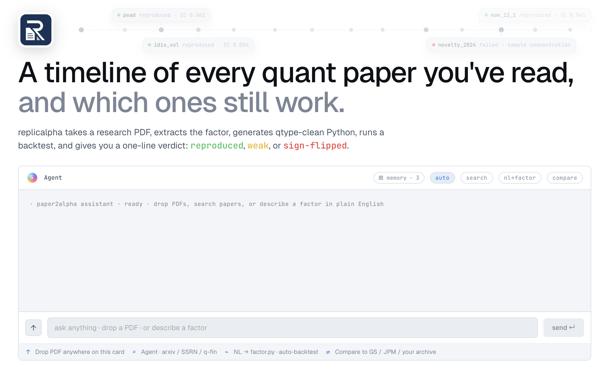

## 产品形态

每一篇你读过的量化研报,都是时间线上的一个节点,带一个一句话判决:**这个因子今天还成立吗?**

### 📈 Timeline · 所有论文 · 所有结论 · 一目了然

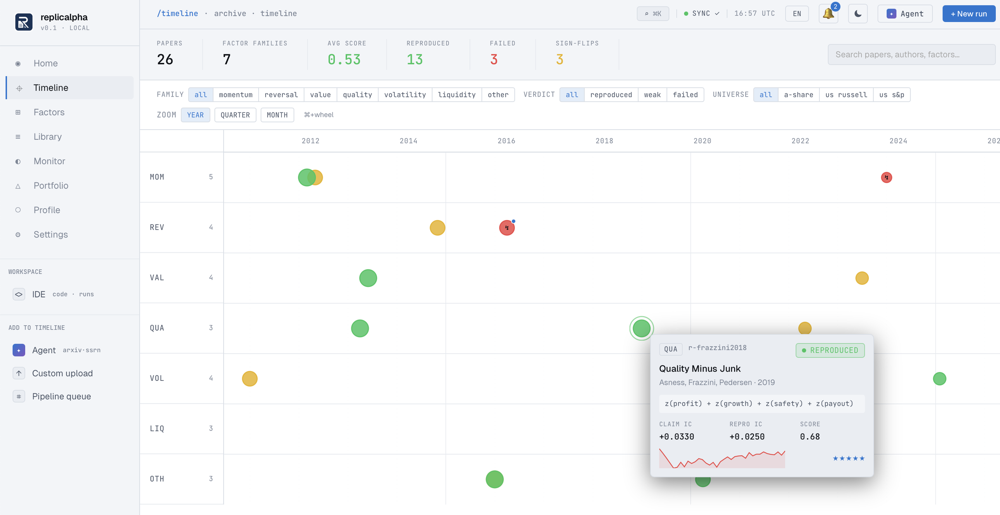

多 lane 时间线,按 reproducibility verdict 染色。Lane 按因子家族分(动量 / 反转 / 价值 / 质量 / 波动率 / 流动性 / 其他)。可按结论 / 股票池 / 家族过滤。悬停查看 mini card 详情。

### 🎯 Verdict · 杀手页

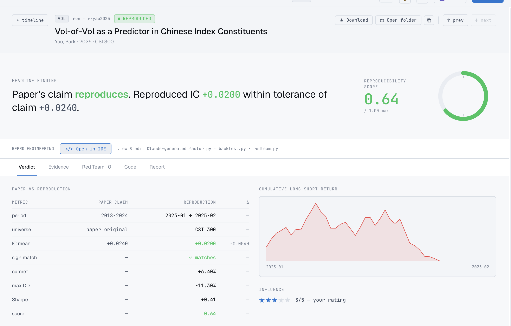

每篇论文一个一句人话的结论 + score 圆环 + paper claim vs reproduction 并排对照 + cumret 曲线。一键 "Open in IDE" 进入工作区调试生成的因子代码。↑↓ 键在时间线上前后切换论文。

### 💼 Portfolio · 用复现成功的因子做纸面交易

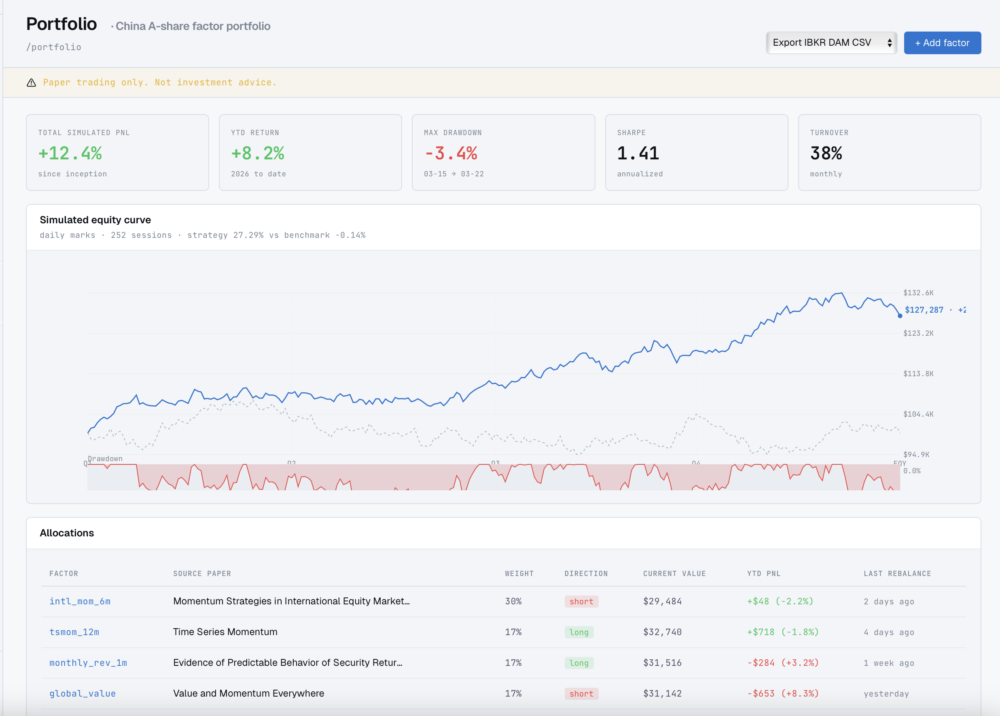

日级 mark 的 equity 曲线 · CSI 300 基准线叠加 · 独立的回撤面板 · 持仓表。上图模拟 252 交易日,策略 +27% vs 基准 −0.14%。一键导出再平衡委托到 IBKR / Tiger / 富途 CSV。

### 🔭 Monitor · 实时 IC 衰减告警

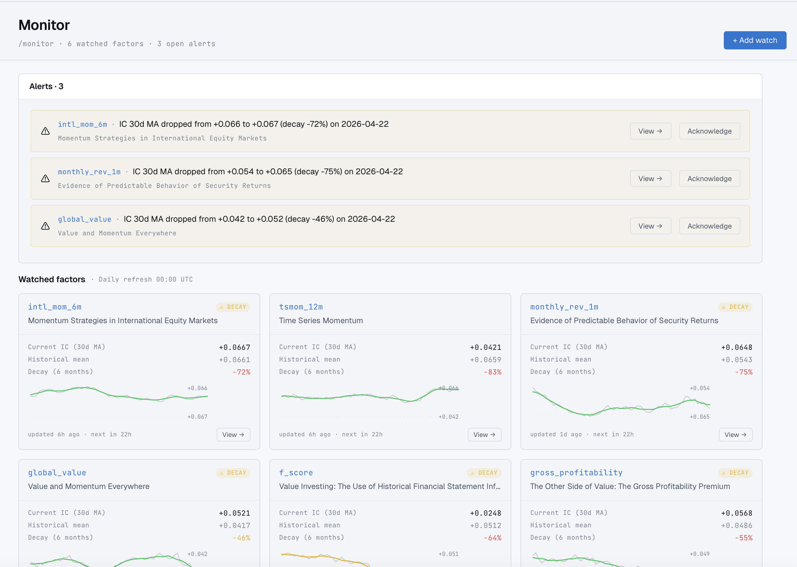

把任何 reproduced 因子加入 watch list。30d IC 滚动均值跌破阈值(衰减 / 符号翻转 / 样本集中度)立刻告警。Sparkline 同时画 raw IC + 7-pt MA + 零基线。

### 🤖 Agent · 从 arxiv / SSRN / Scholar 找论文

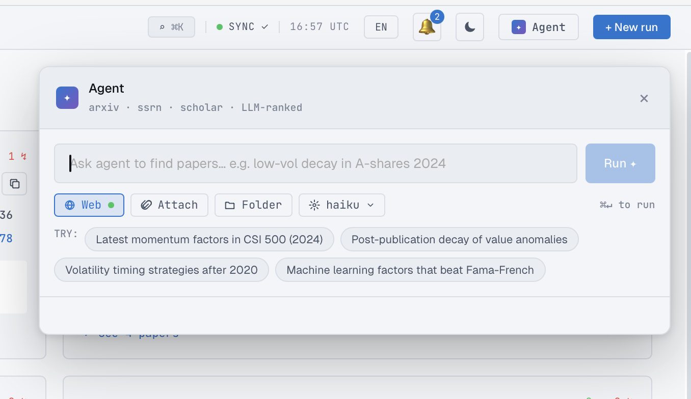

没有 PDF 也行 —— 用自然语言描述方向:*「最近 CSI 500 上的动量因子」 / 「价值异象的发表后衰减」*,Agent 排序候选,你挑要复现哪一篇。

### 📚 Library · 你的研究档案,可查询

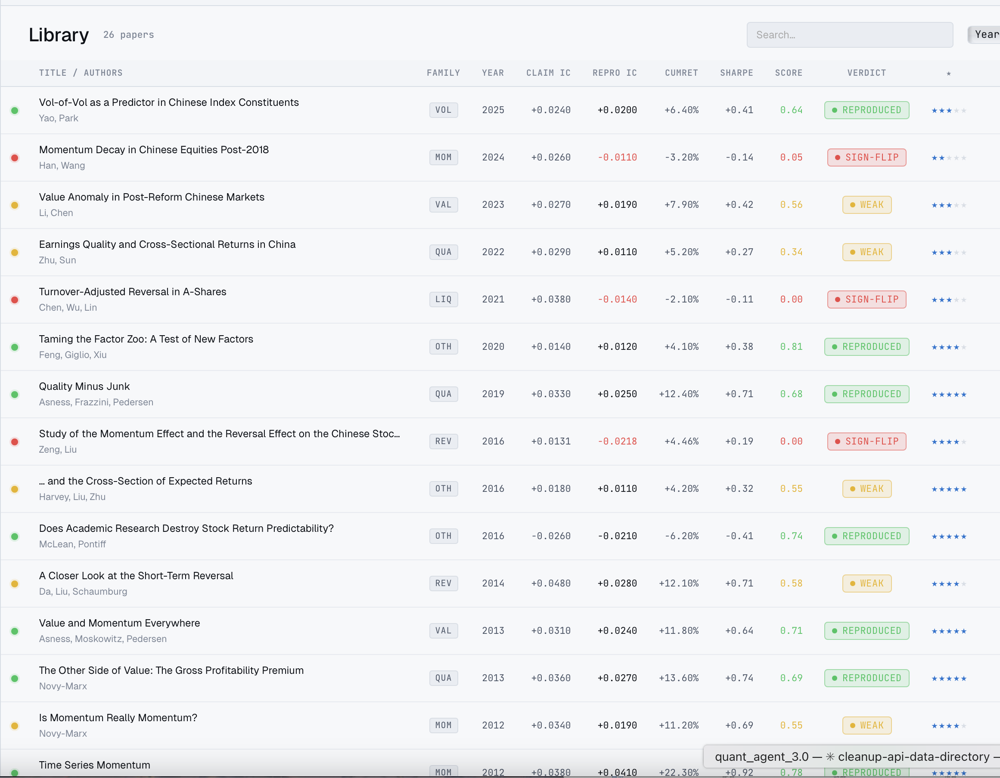

这个 snapshot 里 26 篇。按 claim IC / repro IC / score / family / 年份排序、过滤、多选、批量 re-run、批量导出。

### 🛠️ IDE workspace · Cursor for quant research

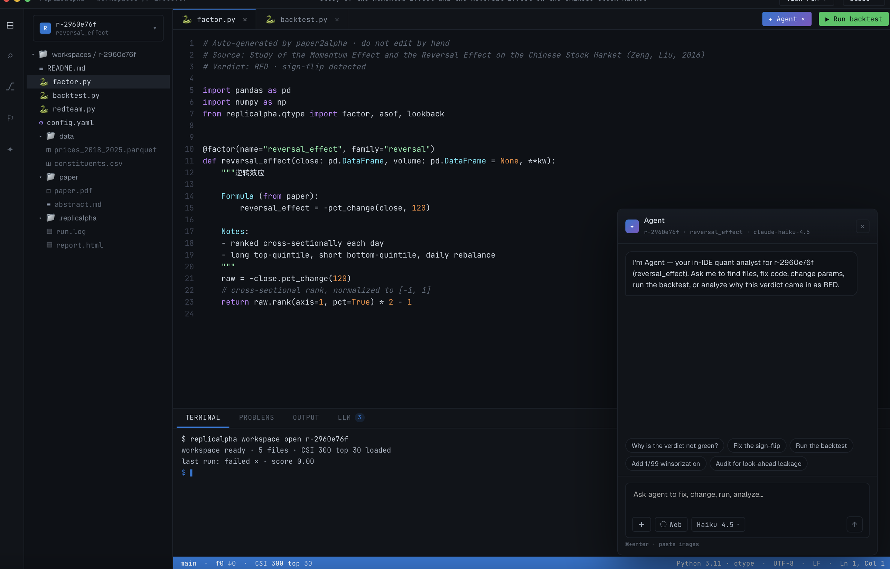

每个 reproduction 都是一个完整的可编辑工作区:PDF + Claude 生成的 `factor.py` / `backtest.py` / `redteam.py`、Terminal、以及上下文感知的 agent —— 它知道 verdict、知道数据、知道代码。Quick-action 按 verdict 动态生成("为什么 verdict 不绿?"/"修复 sign-flip"/"加 1/99 winsorization"/"audit 前视偏差")。

---

中英文双语 · 默认深色 · 全键盘(`⌘K` 一键到达任何页面)。

## 实际运行效果 —— 真实研报 + 真实 A 股数据

复现 **Zeng & Liu (2016)《中国股市动量效应与反转效应研究》**,股票池 CSI 300 前 30 只,Tushare Pro 日频数据,2022-01 至 2024-12:

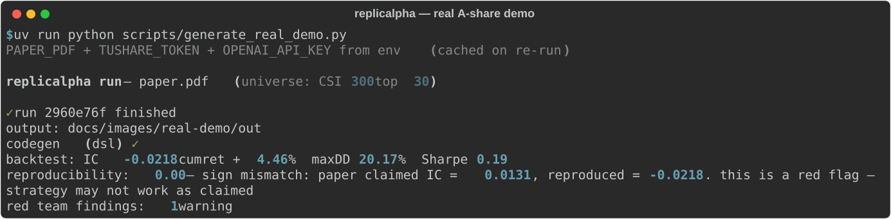

### 核心结论:论文声称的反转效应在新样本上**完全失效**

| | 论文声称 (2010-2016, 554 只) | 本次复现 (2022-2024, 沪深 300 前 30) |
|---|---|---|
| 6 月反转因子 IC | **+0.013** | **−0.022** |
| 符号 | 正向反转 | **符号反转 → 变成动量** |
| 可复现性得分 | — | **0.00**(弱;符号不匹配) |

红队审查同时触发 1 条 warning(单年贡献集中)。这正是 replicalpha 要做的事 —— *把"旧文献因子在新时段/新股池里 sign flip 了"这件事明明白白摆出来。*

### 配图

| 累计多空收益 | 滚动 IC | 回撤 |
|---|---|---|
| 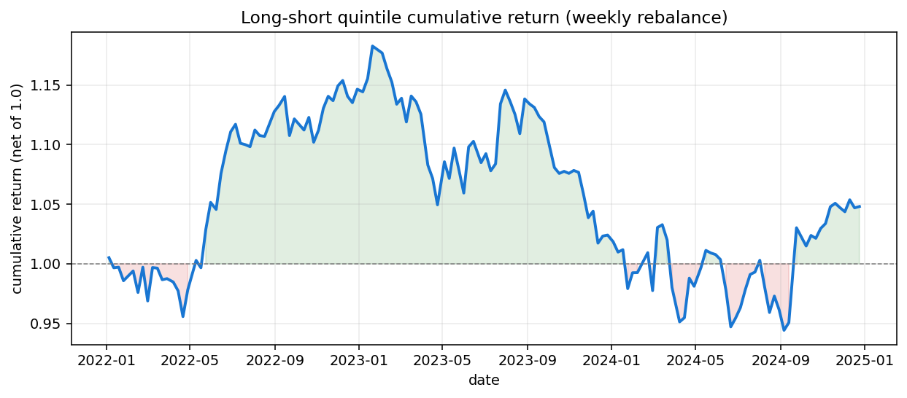 | 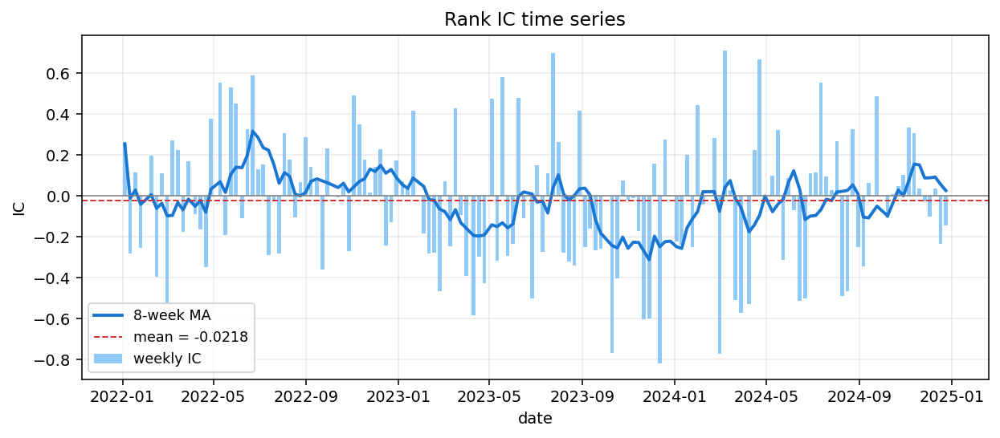 | 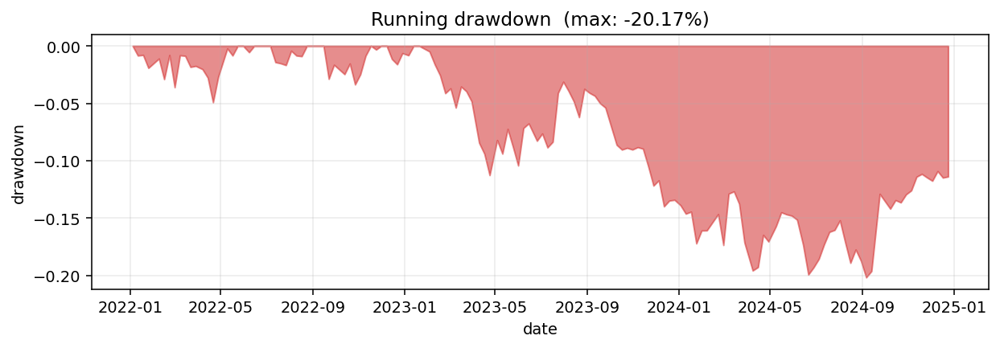 |

完整生成研报: [docs/images/real-demo/report.md](docs/images/real-demo/report.md)。
提取(并手动打磨)出的 ResearchCard: [docs/images/real-demo/research_card.json](docs/images/real-demo/research_card.json)。

### 自己复现这个 demo

```bash
uv sync --extra demo                        # 装 tushare + matplotlib
export TUSHARE_TOKEN=... OPENAI_API_KEY=...
uv run python scripts/generate_real_demo.py  # 会自动下载论文 PDF
```

第一次跑会从 Tushare 拉 4 年 × 30 只(约 1 分钟)+ 一次 OpenAI 调用提取 ResearchCard(约 10 秒)。
之后都从本地 cache 读,几秒出图。

### 用你自己的 PDF + 自己的数据

```bash
uv run replicalpha run your-paper.pdf --data your-csv.csv \
    --out ./out --start 2022-01-03 --end 2024-12-31
```

详见下方 CLI 说明和 DataAdapter Protocol。

<details>
<summary><b>合成数据冒烟测试</b>(不需要 API key,最快通路)</summary>

CI 用的 2 秒冒烟测试见 [docs/images/demo-terminal.svg](docs/images/demo-terminal.svg) 和 [docs/images/demo-report.md](docs/images/demo-report.md)。

</details>

## 流水线

```mermaid
flowchart LR
    PDF[📄 论文 PDF] --> EXT[paper2alpha<br/>PyMuPDF + LLM]
    EXT --> RC[ResearchCard<br/>JSON schema]
    RC --> CG[DSL 解释器<br/>+ LLM 回退]
    CG --> QT[qtype lint<br/>前视偏差检查]
    QT --> BT[pandas 回测<br/>分位数 IC]
    BT --> RT[红队审查<br/>5 项检查]
    RT --> SC[可复现性<br/>得分]
    SC --> MD[📝 报告.md]

    classDef in fill:#e3f2fd,stroke:#1976d2,color:#0d47a1
    classDef core fill:#fff3e0,stroke:#f57c00,color:#e65100
    classDef out fill:#e8f5e9,stroke:#388e3c,color:#1b5e20
    class PDF in
    class EXT,RC,CG,QT,BT,RT,SC core
    class MD out
```

## 快速开始

```bash
uv sync
export OPENAI_API_KEY=sk-...   # PDF → ResearchCard 抽取需要
uv run replicalpha run path/to/paper.pdf \
    --out ./out \
    --data path/to/market_data.csv \
    --start 2022-01-03 --end 2024-12-31
```

输出目录 `./out/`:

- `research_card.json` —— 结构化论文元数据(paper2alpha schema)
- `factor_<name>.py` —— 可执行的 Python 因子(已过 qtype 审)
- `backtest.json` —— IC 时间序列 + 聚合统计
- `validator.json` —— 5 项红队审查结果
- `reproducibility.json` —— 数值得分 + 文字解释
- `report.md` —— 聚合的 markdown 研报

## 离线演示(不需要 API key)

```bash
# 生成一份 mock 的 ResearchCard
cat > /tmp/card.json <<'JSON'
{
  "source": "demo",
  "factors": [{
    "name": "ma20", "chinese_name": "20日均线", "definition": "d",
    "formula": "rolling_mean(close, 20)", "data_fields": ["close"],
    "params": {"lookback": 20}, "universe": "全A",
    "reported_metrics": {"ic_mean": 0.045, "backtest_period": "2022~2024"}
  }]
}
JSON

uv run replicalpha run tests/cases/demo.pdf \
    --out ./demo-out \
    --data tests/cases/sample_market_data.csv \
    --start 2022-03-01 --end 2022-12-31 \
    --extractor-mock /tmp/card.json
```

预期终端输出:

```text
replicalpha run — demo.pdf

✓ run r-1a2b3c4d finished
  output: ./demo-out
  codegen (dsl) ✓
  backtest: IC 0.0123  cumret +2.45%  maxDD 4.21%  Sharpe 0.87
  reproducibility: 0.42  — weak reproduction: claimed IC = 0.0450,
                          reproduced = 0.0123 (72.7% deviation).
  red team findings: 2 warning, 1 critical
```

完整流程见 [examples/reproduce_demo.md](examples/reproduce_demo.md)。

## 红队审查项(v0.1)

| # | 检查项 | 触发条件 |
|---|---|---|
| 1 | `overfitting_hint` | lookback 是非整数(暗示调参) |
| 2 | `small_cap_exposure` | 持仓腿市值中位数 < 池子 0.5 倍 |
| 3 | `data_leakage` | 生成的代码没过 qtype(前视 / 未来函数) |
| 4 | `sample_concentration` | 单年贡献超过累计 IC 的 50% |
| 5 | `factor_redundancy` | 同一论文多因子公式几乎一样 |

## HTTP 服务

```bash
RUNS_ROOT=./runs REPLICALPHA_DATA_CSV=./market.csv \
uv run uvicorn replicalpha.server.main:app --port 8000
```

端点:
- `POST /runs` —— 上传 PDF,启动流水线,返回 `run_id`
- `GET /runs/{run_id}` —— 结构化 `PipelineReport`
- `GET /runs/{run_id}/report` —— markdown 报告(text/markdown)

## 接入自己的数据

replicalpha 内置 20 ticker × 500 day 的合成数据用于 CI 和 demo。
要做真实研究,请实现 `DataAdapter` 协议 (`src/replicalpha/core/data.py`)
接入你自己的数据源(Wind / Tushare / yfinance / Bloomberg / …)。
协议只有 3 个方法:`get_price(field, start, end, universe)`、
`get_trading_days(start, end)`、`get_metadata()`。

## 已知限制(v0.1)

- DSL 白名单之外的公式(不在 `pct_change` / `rolling_mean` / `rolling_std` /
  `rolling_sum` / `corr` / `rank` / `zscore` + 算术里)会回退到 LLM 生成,
  或直接产出 stub。
- 最小 pandas 回测(分位数多空、周频再平衡)。没有交易成本、滑点、仓位约束。
- 红队只是计算检查;LLM 语义批评要到 v0.2。
- 不含实时 / 日内 / 交易执行(路线图 v1.5 → v2.0)。

## 路线图

- **v0.2**:LLM 语义红队、交易成本、Barra 归因、稳健性(walk-forward / bootstrap)、实验记忆(SQLite)。
- **v1.5**:实时因子监控、IC 衰减告警、日内信号。
- **v2.0**:券商 API 对接,纸面交易 → 实盘。

## Vendored 组件

| 组件 | 上游 | 用途 |
|---|---|---|
| paper2alpha | [VernonOY/paper2alpha](https://github.com/VernonOY/paper2alpha) | PDF → `ResearchCard` 抽取 |
| qtype | [VernonOY/qtype](https://github.com/VernonOY/qtype) | 前视偏差 / 未来函数静态 lint |

上游 license 完整保留在 [LICENSE-VENDORED.md](LICENSE-VENDORED.md)。

## 质量

- **52 个测试**(unit + E2E 子进程)· **84% 覆盖** · CI 跑 3.11 + 3.12
- `ruff check` · `ruff format --check` · `mypy --strict` 全绿
- 看 [tests/](tests/) —— `unit/` 是模块级快测,`e2e/` 是全流水子进程测试

## 支持 / 反馈

Bug / 问题 / 想法 —— 开 [GitHub Issue](https://github.com/VernonOY/replicalpha/issues) 或在 [Discussions](https://github.com/VernonOY/replicalpha/discussions) 里聊。详见 [SUPPORT.md](SUPPORT.md)。

## 许可证

MIT —— 见 [LICENSE](LICENSE)。Vendored 组件保留上游 license。
